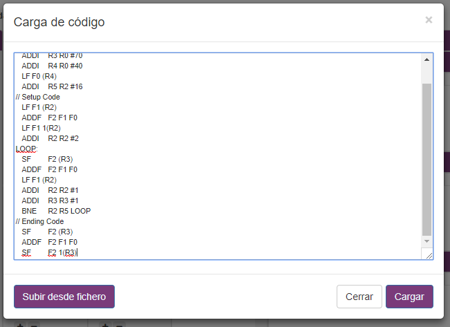
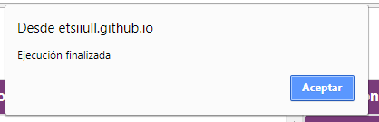
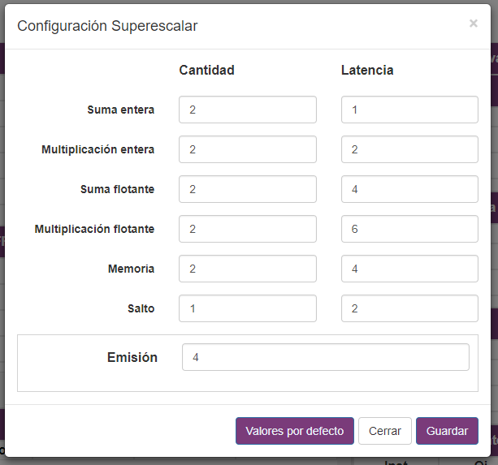

# Basic usage

A typical use for SIMDE would be to check how to optimize algorithms perfomance through changing the machine configuration.

In order to make this we have to develop our algorithm making use of the instruction set.

## Code load

Once it is done, we need to load the program, we just need to make click on the option **Load** in  **File menu**.

We may introduce the code on the textarea field or load a .pla file.

Now we can make basic executions pressing the *Play* button. When it finishes a popup will appear notifying it.

In order to comprobe the results we can make use of the [debugging techniques shown in the following section](./debugging.md).

## Batch execution

Once we have verified that the algorithm is working properly we can use the batch mode. It is located in the **Execution** menu.

In this section we can configure the number of tests to make, the cache fail rate and the cache fail latency.

At the end, a modal will appear showing us statistical info about the test we've made.

## Configuring the superescalar machine

Now we can go to the section **Configure Superescalar machine** in the **Options** menu and repeat the test using different values.

In the modal we can adjust both the functional unit numbers per type and the latency of them.

And repeating the execution we can learn what pieces of the machine are the most important for our algorithm.

