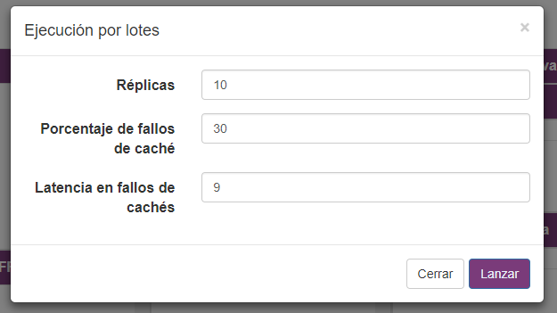
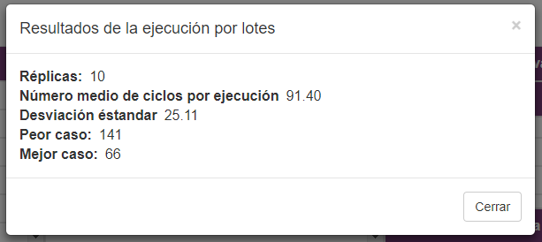

Un caso básico de uso de SIMDE sería comprobar como se pueden optimizar algoritmos mediante el uso de distintas configuraciones de máquina.

Para ello lo primero que hemos de hacer es desarrollar nuestro algoritmo haciendo uso del juego de referencia de instucciones y de las limitaciones mencionadas.

Una vez hecho esto, cargaremos el programa, simplemente tenemos que hacer click en la ópcion **Cargar**, en el **menú Archivo**.

Introduciremos el código en el campo de texto o cargaremos un fichero .pla.

Ahora podremos hacer ejecuciones básicas del código cargado presionando el botón con el icono de *Play*. Al acabar la ejecución aparecerá una ventana emergente indicanos esto.

Para comprobar que los resultados son los esperados podemos hacer uso de las [técnicas de depuración mencionadas en la siguiente sección](./debugging.md).

Una vez que hayamos verificado el funcionamiento del algoritmo, podemos hacer uso del modo de ejecución por lotes, situado en el menú de **Ejecución**, para realizar pruebas del tiempo de ejecución del algoritmo.

En esta sección se puede configurar además del número de pruebas, el porcentaje de fallo de la caché y la latencia en caso de que ocurran esos fallos.

Al terminar, aparecerá un modal mostrándonos una serie de datos estadísticos sobre la prueba que hemos realizado.

Ahora, podemos ir a la sección de **Configurar máquina Superescalar** en el menú de **Opciones** y repetir la prueba con distintos valores.

En el modal podremos ajustar tanto el número de unidades funcionales de cada tipo, como la latencia de las mismas.

Y repitiendo la ejecución podremos valorar que partes de la máquina son más importantes para nuestro algoritmo.

