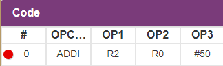

## Puntos de interrupción 

El simulador permite establecer puntos de interrupción tal como se haría en cualquier entorno de desarrollo. Basta con hacer click en el número de la instrucción para que aparezca un circulo rojo a la izquierda indicando que se ha fijado el punto de interrupción.

El punto de interrupción se activará cada vez que la instrucción marcada aparezca en la unidad de prebúsqueda.

// Imagen alert

## Coloreado de instrucciones

Una vez que las instrucciones están en el flujo de ejecución puede ser dificil seguirlas, es por ello que es posible colorearlas para así no perderlas.

Cada fila del reorder buffer es un elemento clickable, al realizar esta acción aparecerá un seleccionador de colores que nos permitirá resaltar la instrucción a lo largo del flujo.

// Imagen color picker

// Imagen instrucción coloreada

## Time-travelling

La nueva versión del SIMULADOR permite además, dar marcha atrás un número limitado de ciclos para ver como se encontraba la máquina en estados anteriores, de esta forma se puede comprobar por qué se ejecutó un salto cuando no debía o a la inversa.

// Secuencia time travelling